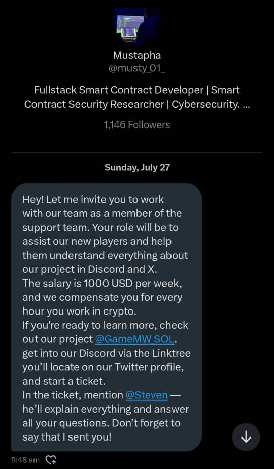
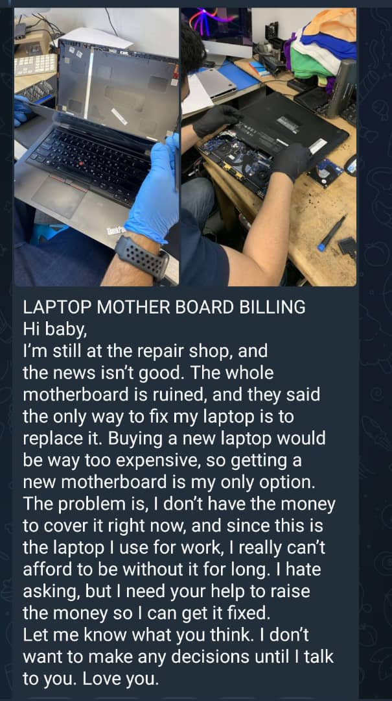
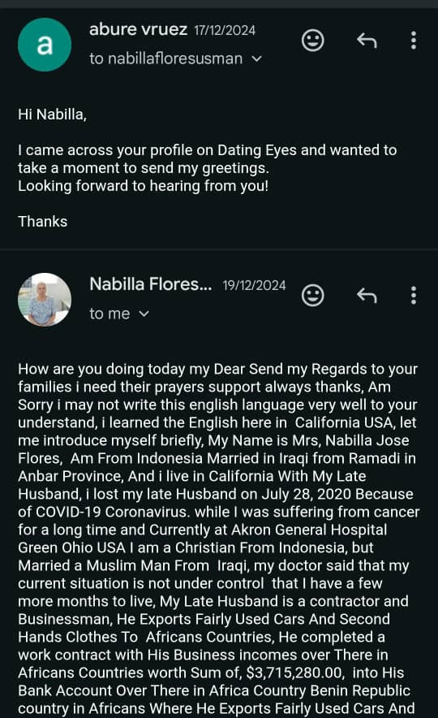

# Case Study: West African Scam Networks - Evolution, Tactics, and Countermeasures

## **Executive Summary**

This case study investigates the operational landscape of West African scam networks, examining how they have evolved from simple email fraud ("419 scams") into complex, multi-layered social engineering and cybercrime ecosystems. These networks—spanning romance scams, investment fraud, and business email compromise (BEC)—operate both locally within Nigeria and globally, targeting victims across continents.

Using open-source intelligence (OSINT), social media analysis, and digital forensics tools, the study identifies recurring patterns, tactics, and psychological manipulation techniques used by scammers. It also explores the socio-economic drivers behind such activities, the role of weak cyber law enforcement, and the international cooperation challenges in tracking and prosecuting offenders.

The ultimate goal is to **enhance pattern recognition and public awareness**, propose an **intelligence framework for scam detection**, and provide actionable recommendations for governments, law enforcement, and cyber-awareness campaigns.

**Expected Outcome:**

1. A structured scam-pattern recognition model (based on TTPs and psychological cues).
2. A comprehensive threat intelligence report mapping scammer typologies, communication flow, and monetization chains.
3. Awareness recommendations and digital literacy framework for communities and online platforms.

## **Background and Scope**

### **Background**

Over the past two decades, West African-originated online scams have evolved from poorly crafted "advance-fee fraud" emails to sophisticated, cross-border operations leveraging technology, social media, and emotional manipulation. These scams, popularly referred to as "Yahoo Yahoo" or "G-Boys" networks, represent a convergence of **cybercrime, social manipulation, and organized fraud**.

The operations often involve:

- **Local scams**: targeting individuals within Nigeria using fake job offers, school admissions, and mobile money schemes.
- **Global scams**: romance fraud, crypto investment schemes, and business email compromise attacks targeting victims in Europe, Asia, and North America.

Such activities not only damage the global reputation of Nigeria but also contribute to **financial losses exceeding billions of dollars annually**, while fostering mistrust in online communication systems.

Despite periodic arrests and enforcement campaigns by EFCC and INTERPOL, most scam frameworks remain **resilient and decentralized**, adapting quickly to detection and law enforcement disruption.

### **Scope of the Case Study**

This study focuses on:

1. **Threat Landscape Analysis** – Mapping scam typologies (romance, BEC, investment, identity fraud, etc.) and their digital infrastructures (social media, email spoofing, crypto wallets, fake websites).
2. **Tactics, Techniques, and Procedures (TTPs)** – Analyzing psychological manipulation, communication flow, language patterns, and social engineering stages.
3. **Pattern Recognition Model** – Developing a framework to identify red flags and behavioral indicators that victims can use to recognize scammers early.
4. **Socioeconomic and Cultural Drivers** – Understanding how unemployment, peer influence, and online subcultures contribute to the persistence of scams.
5. **Strategic and Intelligence Implications** – Exploring how such cyber-fraud affects international trust, digital diplomacy, and the need for coordinated intelligence sharing.

## **Methodology**

### **1. Research Design**

This study employs a **mixed-method approach**, combining qualitative intelligence analysis with quantitative data from scam reports and digital trace evidence. It aims to **map scam operations**, **identify behavioral and technical patterns**, and **propose a pattern-recognition framework** for early detection.

### **2. Data Sources**

| Data Type | Description | Tools / Sources |
| --- | --- | --- |
| **Open-Source Intelligence (OSINT)** | Social media profiles, scam forums, leaked conversations, and dark web chatter | Maltego, SpiderFoot, Social-Searcher, TweetBeaver, manual search |
| **Public Scam Databases** | Reported scam data and victim testimonials, e.g., via family members, social media posts | Scamwatch (Australia), IC3 (FBI), Europol reports, Nigerian EFCC updates |
| **Email / URL Forensics** | Analysis of scam email headers, domains, and links | MXToolbox, VirusTotal, URLScan.io, Anomix (my custom made tool) |
| **Textual and Linguistic Analysis** | Detecting linguistic deception, sentiment tone, and emotional triggers that can lead to spotting scam attempts | LIWC, Python NLP libraries (spaCy, NLTK) |
| **Socioeconomic Context** | Interviews, media reports, and policy documents | World Bank data, local Nigerian media, EFCC public statements |

### **3. Analysis Techniques**

- **TTP Mapping (Tactics, Techniques, Procedures):**
    
    Each scam sample is categorized according to MITRE ATT&CK-like mapping (initial contact, manipulation, monetization, laundering). We can see this in detail later through how the scammers use their TTPs on dating websites to make fake relationships which initially start with fake promises and claiming to be someone that they are not, eventually starting to ask for money by claiming that they forgot their wallet, etc.
    
- **Behavioral Analysis:**
    
    Patterns of approach, emotional manipulation, and "relationship-building" are documented and compared. Scammers have a specific pattern of approach; it depends on the type of scamming method. For example, if the scam is to lure someone into making fake donations, they will begin by sending videos of people in difficult situations and ask people to contribute.
    
- **Network Analysis:**
    
    Connections among scammers, mule accounts, and social circles are visualized using **Maltego** or **Gephi**. I have seen several platforms that pretend to offer services such as helping catch scammers; they are also part of the game. Finding such similar platforms and their social media can help in correlating their services and uncovering their network.
    
- **Pattern Recognition Model Development:**
    
    Using case data, a rule-based recognition model is created that flags red flags like unusual phrasing, urgent requests, or mismatched identities.
    

---

## **Findings & Scam Pattern Recognition Model**

### **1. Typology of Nigerian Scam Operations**

| Scam Type | Target Group | TTPs Used | Key Objective |
| --- | --- | --- | --- |
| **Romance / Dating Scam** | Lonely individuals globally | Fake online personas, emotional grooming, urgent financial requests | Emotional and financial exploitation |
| **Business Email Compromise (BEC)** | SMEs and corporate executives | Phishing, email spoofing, fake invoices, impersonation | Financial redirection |
| **Investment / Crypto Scam** | Global youth, online investors | Fake websites, impersonation of companies, deepfake endorsements | Crypto theft |
| **Local Job / Scholarship Scam** | Nigerian youth | Fake job offers, credential harvesting | Identity theft, advance fees |
| **Information Gathering** | Global youth, online investors | Through Google forms, fake links to fill for data collection | To collect user PII |

### **2. Key Patterns & Indicators**

### **A. Technical Patterns**

These are technical patterns and indicators that can help identify scam activities:

- Similar IP clusters and hosting locations (e.g., cheap VPS in Europe or Asia).
- Reuse of fake domains mimicking legitimate institutions.
- Common use of free email domains (Gmail, Outlook) with name variations.
- Social media accounts using stolen photos (detected with reverse image search).

### **B. Behavioral Patterns**

- **Emotional acceleration**: scammers move conversations quickly to emotional dependency.
- **Urgency tactics**: time-limited "emergency" or "deal" to suppress rational thinking.
- **Language tone**: overly romantic or formal English inconsistent with native use.
- **Financial angle**: introduction of money issues within 7–14 days of contact.

### **C. Socioeconomic & Cultural Cues**

- Peer validation and online bragging ("Yahoo lifestyle").
- Perception of cyber-fraud as "hustle", not crime.
- Weak deterrence due to limited prosecution and glamorization on social media.

---

### **3. Operational Flow of West African-Origin Scam on Dating platforms

**Quick Flowchart**

# How a West African-style scam usually unfolds

Think of a scam like a staged play with many small scenes. The actors (scammers) prepare a script and props (I will provide you samples later), find an audience (you or someone like you), and then slowly guide the story toward the moment they ask for cash. Below I walk you through each scene: what the scammer is doing, what it looks like, the little red flags you can spot, and what *you* should do right away.

---

## 1. The Planning (Setting the goal)

**What's happening:**

Before they contact anyone, scammers decide what they want: quick cash from lots of people, a big single haul (romance + large sum), bank fraud (BEC), or recruits to pick up cash (mules). They pick a script and gather props: photos (picked from social media handles), fake documents, message templates.

**Picture it:**

They're in a room building a character: choosing a convincing photo, writing sweet messages, or making a fake CV. They prepare payment routes (crypto wallets, mobile money numbers) and a cleanup plan.

**Early indicators:**

- A newly created account with a beautiful lady or handsome guy texting you on social media.
- Someone calling you pretending to be someone and asking for personal information.
- A random person that you don't know texting you in DM with an unfamiliar name/face.

**What you should do:**

- Not much you can do here. Block them right away and keep an eye out for brand-new accounts reaching out a lot.
- Avoid publicly sharing your information online; if possible, make your account private so only your real friends can see your profile and text you.
- Do not click or reply to any person without confirming their profile.

---

## 2. The Script Choice (Pick the scam type)

**What's happening:**

They choose the story that fits the victim: love story on dating apps, "job offer" on LinkedIn, "investment opportunity" on social media, or an invoice request to a corporate finance person.

**Picture it:**

They pick a costume: a military photo for romance, a polished CV for job scams, slick investment pages for crypto fraud.

**Indicators:**

- Messages that seem tailored to the platform (a "professional" tone on LinkedIn, intimate tone on Tinder).
- Profiles that look *too* perfect or oddly sparse.
- Look out for persuasive, flirting texts.
- A foreign phone number texting you on WhatsApp, e.g., someone from America. Scammers never use their phone number; instead, they use temporary and disposable ones.
- Reverse look up the image of the profile that messaged you using Google, Yandex, Bing image search. Scammers reuse pictures; that will show you all the images and where it's used. You often see the same picture with different names.

**What you should do:**

- Think about context: on a dating app, expect casual conversation first; on LinkedIn, expect a clear professional identity. If something is out of place (a "CEO" who can't answer simple job questions), that's suspicious.
- If the same image is used across social media with different names, it's highly suspicious; block the person.
- Block any suspicious account reaching out to you.
- A random person texting you and telling you how adorable you are? Red flag.

---

## 3. Targeting & Recon (They study you)

**What's happening:**

Scammers quietly look you up: your public posts, pictures, where you work, who you're connected to. They gather details they will later repeat to sound convincing.

**Picture it:**

Imagine someone peeking through your public social media, bookmarking your photos, and noting your hometown, then using that to open conversation: "Oh you're from Lagos? Me too!"

**Indicators:**

- The person mentions specific personal details very quickly (your town, your job, a hobby), even though you barely know them.
- They use info that you posted publicly but didn't expect a stranger to reference.

**What you should do:**

- Pause. If someone knows many little details early on, ask how they know them. Don't feel pressured to share more.
- Avoid sharing every detail of yourself on the internet; they will take it and use it against you.
- Check whether the details match across platforms (is the same username or photo used elsewhere?).

---

## 4. First Contact (Gentle hook)

**What's happening:**

They send a friendly, well-timed opening message. It's polite, flattering, or relevant—designed to get a reply.

**Picture it:**

A message that starts with "Hi there, loved your photo" on Tinder; or "I saw your profile and think you'd be perfect for this role" on LinkedIn. Or someone sends you a long message offering you a job position which sounds highly unlikely or asking you to contact others.

**Indicators:**

- The message is oddly direct or flows like a template and might sometimes contain links.
- The sender sends many first messages to many people.
- If sent via email, it mostly falls in the spam section.

**What you should do:**

- If you don't know them, keep replies short and non-committal. Once confirmed it's a scam, block them and expose them online.
- Don't click links or download attachments. If curious, do a reverse image search on their profile picture.

Here is an example of someone contacting me via Twitter(X):

---

## 5. Grooming & Rapport (Building trust)

**What's happening:**

This is where they warm you up. Compliments, shared feelings, "I understand you", or "we have so much in common." They may move the chat to private apps (WhatsApp, Telegram) quickly to avoid platform oversight.

**Picture it:**

They are painting a picture of closeness: late night chats, long messages, quick trust-building. They send photos or "proof" to seem real.

**Indicators:**

- Fast emotional language within days.
- Requests to leave the dating/site's chat for private messaging.
- Repeated excuses to avoid a live video call.

**What you should do:**

- Keep conversations on-platform while you verify. Platforms often have safety measures.
- Insist on a video call early if the relationship is supposed to be real. Genuine people will happily do it; scammers usually avoid it.
- Use reverse image search on photos they send.

---

## 6. The Proofs (They show you evidence)

**What's happening:**

They send staged photos, fake bank screenshots, or forged documents to appear real or important. Now AI is everywhere; a fake identity can be easily generated.

**Picture it:**

A photo of a suit, a passport scan sent as "proof", or a bank screenshot with a name that looks legitimate.

**Indicators:**

- Photos that look like stock images or appear in multiple profiles online.
- Documents with odd fonts, inconsistent details, or that don't match what they said.

**What you should do:**

- Always verify: ask for something live (video, show a photo with today's newspaper/new hand sign).
- If shown documents, ask specific follow-up questions that a forger can't easily fake.

---

## 7. The Little Test (Small favor)

**What's happening:**

They ask for a tiny favor: "Can you send $10 airtime?" or "Can you receive a small transfer and forward it?" This tests your willingness to help and sometimes captures details. They sometimes tell you they forgot their wallet or they are in a certain condition and they want a small help from you. They will show that they don't like asking, but it's just urgent, that's why.

**Picture it:**

A friendly "can you help? My card declined, send me $20 and I'll repay" text that feels low-risk.

Another example can be: "Hey, I came out to buy something but my money is not complete; can you help me with 100£? I will pay you later."

**Indicators:**

- First monetary requests appear quickly and seem reasonable.
- Bringing up excuses to ask for money.
- Requests to verify a code you (or they say you) received; this can be a credential theft trick.

**What you should do:**

- Never send money to someone you have just met.
- Don't share verification codes or password recovery messages. If asked to "confirm a code," it's almost always malicious.

This is an example of a request:

## 8. The Big Ask (The trap closes)

**What's happening:**

If the test works, the scam escalates: they ask for larger sums, urgent help, or to process a "business" transaction. They use pressure, fear, or promises of future reward.

**Picture it:**

A panicked message: "I am stuck at the airport—I need $2,000 now," or, for BEC, "Please pay this urgent invoice to avoid legal action."

**Indicators:**

- Strong emotional urgency: act now or bad things will happen.
- Payment routes that are hard to trace: crypto, gift cards, Western Union, mobile money.
- The person asks you to do things that expose your accounts (logins, transfers).

**What you should do:**

- Stop. Talk to a trusted friend or family first.
- Never send money via gift cards or crypto to someone you haven't met in person.
- If this involves a company invoice, call the company directly using a publicly listed number—don't reply to the email.

## 9. Getting Paid

**What's happening:**

They collect funds and move them quickly: split into small transfers, transfer to mule accounts, or convert to crypto. They try to get money out before detection.

**Picture it:**

A spiderweb of accounts, each moving small bits of cash so the trail is confusing.

**Indicators you might see:**

- Unusual payment requests from someone who's new in your life.
- A beneficiary account that looks personal and not tied to any company.

**What you should do:**

- If you have sent money, contact your bank immediately and report fraud.
- Keep copies of all messages and receipts—they help law enforcement.

## 10. Clean Up & Move On (They disappear or reuse)

**What's happening:**

After success (or near-miss), they delete accounts, change wallets, and reuse elements of the scam elsewhere. If you resist, they might threaten to embarrass you (blackmail), or sell the data.

**Picture it:**

The account disappears, or the person keeps pushing for silence: "Please delete our chat."

**Indicators:**

- Accounts vanish suddenly.
- New similar accounts pop up elsewhere using the same pictures or language.

**What you should do:**

- Don't comply with requests to delete evidence.
- Report the incident to the platform, your bank, and local consumer protection or police.
- Consider a credit/block monitoring service if you shared personal info.

## 11. How you can help

We are currently building a threat intelligence platform where you can upload the contact details of the scammer, including wallet addresses, phone numbers, emails, domains, IPs, etc. Contributing by uploading the content will help in detecting scammers and avoiding future scams.

Also, on the platform, you will get to know their TTPs and how to detect a variety of scams around the world.

## Final thought: trust your gut and use small tests

Real people accept small, sensible tests (a short video or a phone call) and don't push for secret money channels. If something feels off, that feeling is worth acting on: slow down, verify, ask for public references, and never send money to a stranger. If you ever suspect a scam, save the messages and report them; your report may stop others from falling for the same script.

### Real World Scenarios of Different Scam Activities with Examples

These examples are some scam activities that I came across.

Note: I will be sharing real links and some are still active; you gotta watch out for those platforms.

## Scenario 1

More than 3 years ago, I wasn't aware about scamming. I was on LinkedIn when a lady invited me to invest on a platform where I can invest and get fixed returns in return weekly/monthly. I did that; I invested a few dollars and after weeks I withdrew profit. I was happy, I deposited more to earn, and after a month I made another withdrawal. She asked me to invite others and get referrals; it would help me get some percentage. I did that; I invited a few members of my family.
After we made the deposit, after a month we tried to withdraw and it didn't work. I contacted the woman and she said I should make a 2x deposit, then I will be able to withdraw. At that moment, I realized I fell for a Ponzi scheme scam.

I didn't know what to do. I reached out to others online for help to get my money back. I contacted two people; one is [https://www.scamadviser.org](https://www.scamadviser.org/). I picked their email and contacted them to help me get my money back. After some time, they contacted me and said, "We are able to recover your money and now it has increased."
As you can see in the image below:

It sounds suspicious, but I follow along, and the reply was that I should contact this number, as you can see below:

I contacted the number; we chatted, he was giving me instructions to go to my Crypto wallet, copy-paste the address, take screenshots and send him.

Moral of the story...
Be careful of people you reach out to or those who pretend to offer services online; some of them are scammers. If they are asking you to send personal details, download attachments, send screenshots, then they can be scammers.

## Scenario 2

I signed up on a dating platform and began exploring fake profiles. I saw a profile that had an email address written on it. Then I picked the email address and sent a cool email, as you can see below.

Then, I got a reply, which is too good to be true, as you can see in the screenshot below.
It's 100% scam, and you should avoid trusting people on social media no matter what story they tell you.

## Scenario 3

Someone contacted me on Twitter offering me a job, as you can see below.

No organization name, brand, and the amount is too high for such work, and he was busy referring me to others.

## Scenario 4

In my college email, I mostly get a text that I have been shortlisted for a job, internship, please I should fill this form.
It asks for my personal info and sometimes required fees. I really don't know how they get my email address, but the pattern is clear: anyone can generate a valid email ID of a student by following the format. avoiding filling google forms and give your information for free to scammers, they will use it later to scam you

## Scenario 5

I met a guy on a platform that claims to have real buyers of Pi crypto; it listed their profiles as legitimate ones, so I picked one and DM'd. He was asking me to send him the coins first before payment.
I said I'm not gonna do that; he was busy sending me proofs of his transaction with others, but it's all fake. As I reverse the image, I see where it came from.

Of course. Here is a short header you can place at the end of your current case study to tease the next one, including a title and a concise summary.

---

### **In the Next Case Study**

**Title:  Mapping the Digital Underground of West African Cybercrime**

**Summary:** We will move beyond the individual scammer to expose the sophisticated ecosystem that supports them. This next analysis will detail the underground markets for victim data, the networks of forgers creating fake documents, and the "scam-on-scam" world of fake recovery services. Finally, we will outline the architecture for a collaborative threat intelligence platform designed to track, expose, and disrupt these networks at scale.
